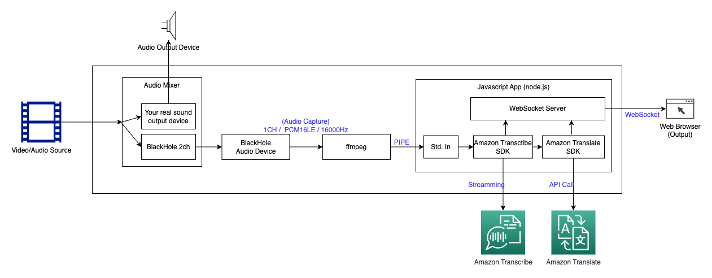
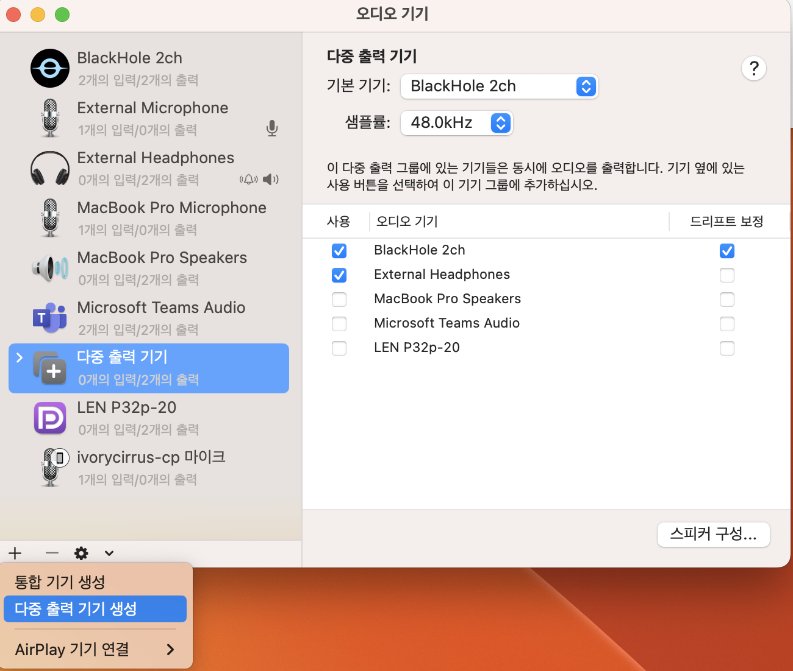
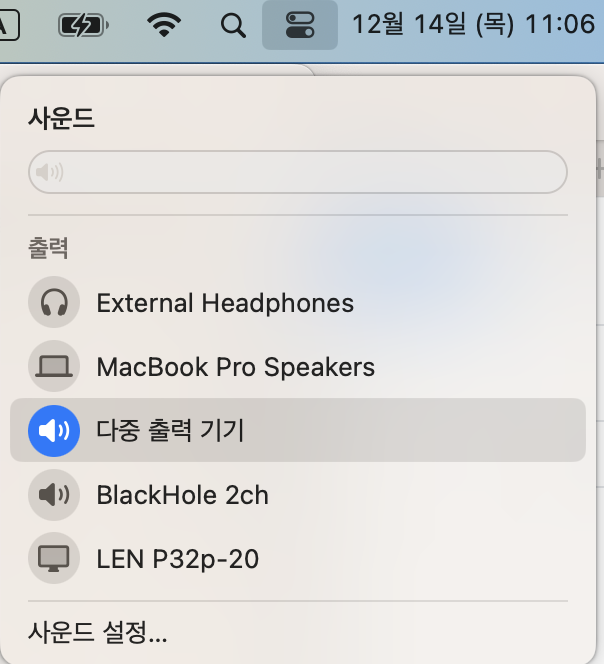
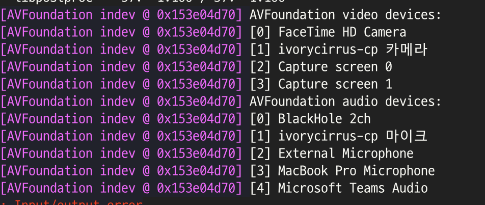

# LiveStream Translator
LiveStream audio translator for MacOS.
The application runs with Amazon Transcribe and Amazon Translate.

## 1. Demo


## 2. Architecture


## 3. QuickStart
### Requirements
* node.js 18.x or higher
* ffmpeg
* BlackHole (or other audio loopback altinatives)

### Audio Setup
#### Install ffmpeg & BlackHole
```
$ brew install ffmpeg
$ brew install blackhole-2ch
```
#### Setup BlackHole
* open MacOS setting app `FinderApp > Applications > Audio MIDI Setup`
* Create `Multi-output device`
* Check audio sources for simultaneously loopback

* Select your `Multi-output device`


### AWS Account
* prepare AWS Account and commandline profile
* grant to access Amazon Transcribe and Amazon Translate
```
$ export AWS_ACCESS_KEY_ID=${REPLACE_YOUR_ACCESS_KEY_ID}
$ export AWS_SECRET_ACCESS_KEY=${REPLACE_YOUR_AWS_SECRET_ACCESS_KEY}
```

### Run server
#### Install node.js dependencies
```
$ npm install
```

#### Start server
* run ```start.sh```
* web browser opened and connected to local server automatically
* play your audio source
* Enjoy it

## 4. (Optional) Configurations and Trouble Shootings

### Transcribe and Translate Configurations
* If you want to change values, open and edit ```index.js``` file
* Default values are
    * Audio source language is en-US by default
    * Target translated language is ko-KR by default.
    * And AWS Seoul region(ap-northeast-2) is used.


### Check audio input source
#### Check Audio Source
* Check BlackHole audio source index (BlackHole 2ch)
```
$ ffmpeg -f avfoundation -list_devices true -i ''
```


#### Update index of Audio device
* open ```start.sh```
* replace ```$AUDIO_DEVICE_ID``` for your BkackHole audio source index

## 5. References
* [Amazon-Transcribe-Streaming-Live-Subtitling](https://github.com/aws-samples/amazon-transcribe-streaming-live-closed-captions/tree/main)
* [Real-time Audio to Text Transcription with Amazon Transcribe and WebSockets in Node.js](https://blog.devops.dev/real-time-audio-to-text-transcription-with-amazon-transcribe-and-websockets-in-node-js-1ae068a99cec)

## 6. License 
MIT-0